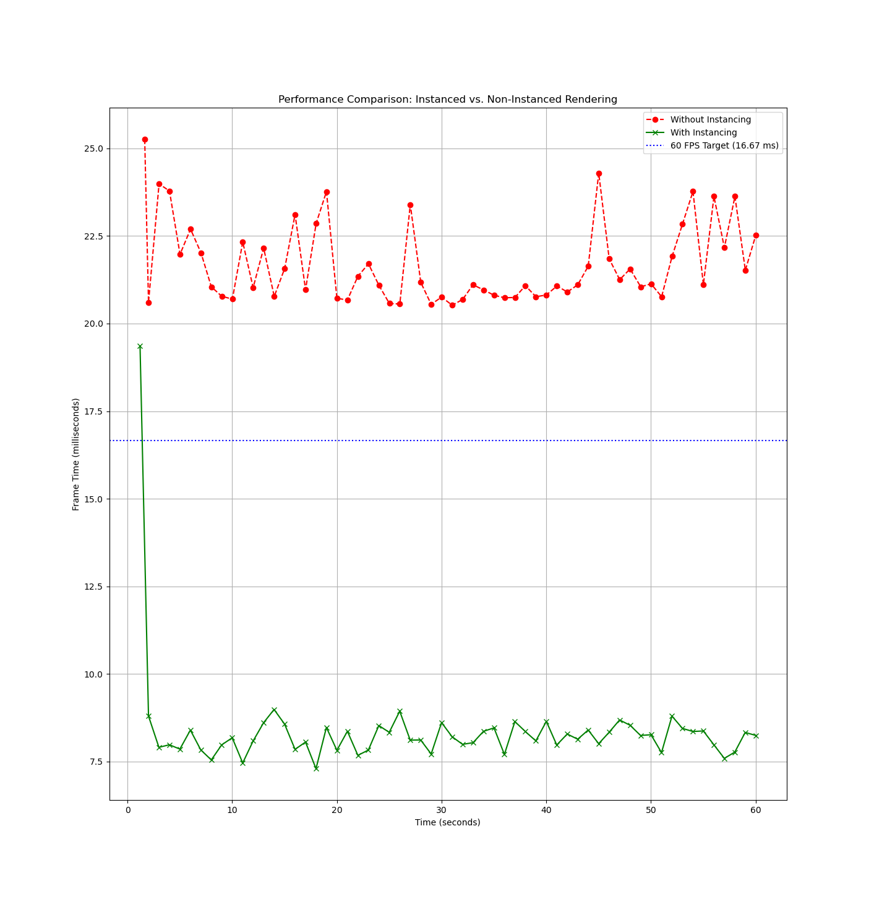

# 3D graphics @ UCU homework

**Name/Surname**: Roman Pavlosiuk

**API**: OpenGL

**Late days**: 0/7

## How to build

To build, just do

```sh
cmake -B build
cmake --build build
```

## HW1

#### Basic features

- Step 1: Create a project with an empty window
- Step 2: Add an Euler Camera
- Step 3: Handcraft a cube
- Step 4: Apply two different pixel shaders

#### Additional Features

## HW2

#### Fixes from HW1:

- Removed callbacks.h from CMakeLists
- Moved shaders from cmake-build-debug to project

#### Basic features

- Step 1: Use Assimp to create a 3D model loader
- Step 2: Load a model with the loader with its respective textures and render it in your scene ( lpshead )
- Step 3: Instanced rendering
- Step 4: Huge plaform a.k.a floor
- Step 5: Performance tests (10k cubes, also made additionally 100k cubes to see the real difference)





p.s: i have 120hz monitor on laptop\

p.s.s: change **defines** in `main.cpp` as you wish for turning on step2model, performanceLogging or for instanced method or not

We can see the difference in performance even on 100k cubes instance rendering is much more better than non-instanced.
The more cubes the more difference, but on small like 1k or less it's pretty the same, but it's because it almost always 120fps

On 100k cubes we got:
- 3-5 fps non-instanced
- +-60 fps instanced

On 10k cubes:
- +- 60 fps non-instanced 
- 115-120 fps instanced

On 1k cubes:
- Both like 115-120fps

#### Additional Features
(Own) Performance comparison on 100k cubes
## HW3

#### Basic features

#### Additional Features

## HW4

#### Basic features

#### Additional Features

## HW5

#### Basic features

#### Additional Features
